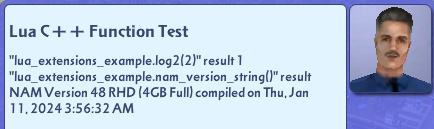

# sc4-lua-extension-example

A DLL Plugin for SimCity 4 that demonstrates adding new C++ functions for the game's Lua system to call.   

The plugin can be downloaded from the Releases tab: https://github.com/0xC0000054/sc4-lua-extension-example/releases

## System Requirements

* Windows 10 or later

## Installation

1. Close SimCity 4.
2. Copy `SC4LuaExtensionExample.dll` and `LuaExtensionExample.dat` into the top-level of the Plugins folder in the SimCity 4 installation directory or Documents/SimCity 4 directory.
3. Start SimCity 4.

## Usage

The game's Urgent Advice dialogs must be enabled for the plugin to work.
It will show a _Lua C++ Function Test_ message box upon entering an established city.

## Troubleshooting

The plugin should write a `SC4LuaExtensionExample.log` file in the same folder as the plugin.    
The log contains status information for the most recent run of the plugin.

# License

This project is licensed under the terms of the MIT License.    
See [LICENSE.txt](LICENSE.txt) for more information.

## 3rd party code

[gzcom-dll](https://github.com/nsgomez/gzcom-dll/tree/master) Located in the vendor folder, MIT License.    
[Windows Implementation Library](https://github.com/microsoft/wil) MIT License    

# Source Code

## Prerequisites

* Visual Studio 2022

## Building the plugin

* Open the solution in the `src` folder
* Update the post build events to copy the build output to you SimCity 4 application plugins folder.
* Build the solution

## Debugging the plugin

Visual Studio can be configured to launch SimCity 4 on the Debugging page of the project properties.
I configured the debugger to launch the game in a window with the following command line:    
`-intro:off -CPUcount:1 -w -CustomResolution:enabled -r1920x1080x32`

You may need to adjust the resolution for your screen.
